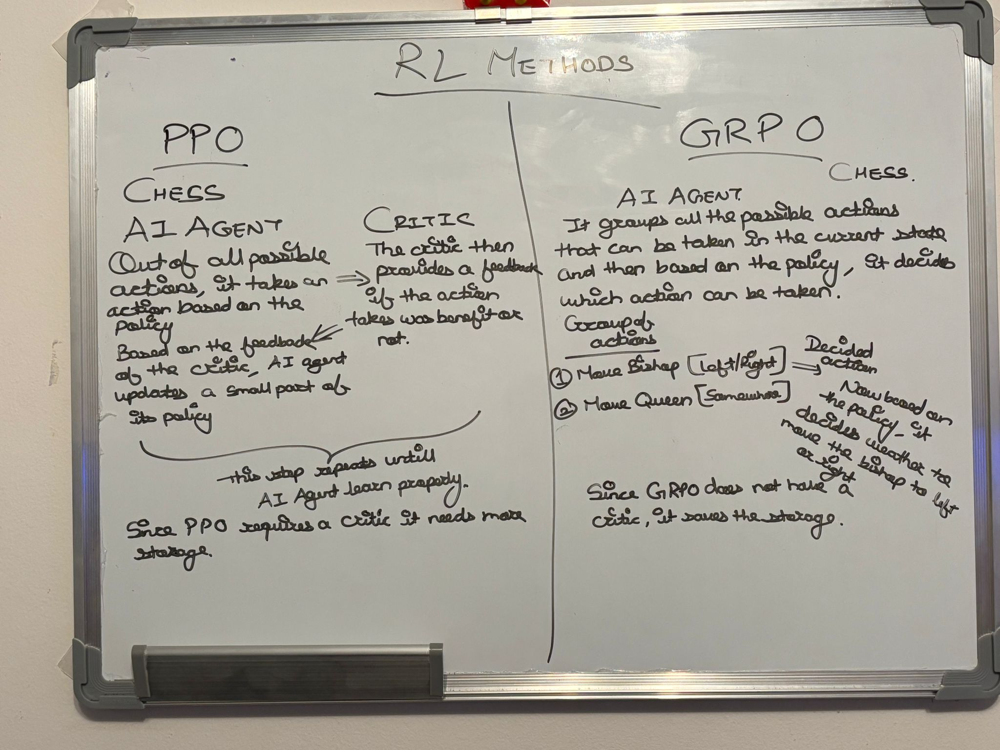

# AI Model Terms

## Large Scale Reinforcement Learning
- Reinforcement learning is a type of learning that models do by trial and error.
- It helps model improve over time, based on feedback.
- "Large Scale" refers that the reinforcement learning of the model, happened at a large scale, as the name suggests.

## Supervised Fine-Tuning
- Before pushing the model to learn on its own, it is first taught using examples and correct answers.

## Artificial General Intelligence
- Artificial General Intelligence is a type of AI that can think, learn and understand things, just like a human.
- Today's AI can be referred as Narrow AI that can do specific things well, liking answering questions, self-driving cars etc. but cannot learn completely new things by itself or think like humans.
- If you teach AGI a new subject like physics or cooking, it can learn by itself and can apply that knowledge just like a person.
- A chess-playing AI today is amazing at chess but **useless** at driving a car.
- An AGI would be able to learn chess, driving, painting, programming, and more—just like a human can.

## Full-Training Pipeline
- As the name suggest, a training pipeline is a step by step process of training an entire model.
- It starts from raw data and ends into a working AI model.

### Key Steps
1. Data Collection
2. Data Processing: Clean, Organize, and Format the data so that AI can understand it.
3. Pretraining: Teach AI basic knowledge using huge amounts of data.
4. Fine Tuning: Improve the AI by training it on specific tasks or making it more accurate.
5. Reinforcement Learning (Optional): Give the AI feedback (rewards or penalties) to refine its responses.
6. Evaluation and Testing: Check if the AI is performing well and fix any mistakes.
7. Deployment: Make the AI available for the real world.

## Post-Training
- As the name suggests, it is the training that happens after the main training of the AI model.
- It includes an extra step to make sure that the model is more accurate, useful and safe for the real world applications.
### Common Post-Training Steps
1. Reinforcement Learning (RLHF/RLAIF): Teaching the AI to respond better using feedback from humans or other AI models.
2. Safety Filtering: Removing harmful, biased, or incorrect responses.
3. Alignment Tuning: Ensuring the AI follows ethical guidelines and user expectations.
4. Quantization & Optimization: Making the model smaller and faster for real-world use.
5. Deployment Readiness Testing: Checking the model's accuracy, fairness, and reliability.
### Reinforcement Learning
#### Reinforcement Learning from Human Feedback
- The model is trained by real people's feedback
- Humans rate or compare the responses and the model learns the user preference for the response generation.
**Example**
- The AI generates two different answers to the questions and the user picks which answers is the better one.
- This way the AI updates itself to produce better responses.
#### Reinforcement Learning from AI Feedback
- The feedback is given by another AI.
- The model learns from this ranking and further improves itself.
## Inference Time Scaling
- Inference Time is the time when someone is using AI to generate responses.
- Inference Time Scaling is the technique used to improve performance and efficiency of AI models during the inference phase.
- The performance and efficiency is improved by dynamically adjusting the computational resources allocated to the model based on the complexity of input data or the specific task at hand.
## Chain-of-Thought Reasoning
- It is a way that AI models take to think step by step before answering any question.
- It is like breaking a complex problem into smaller steps to solve it.
### How It Works?
1. Thinks in steps: Breaks the problem into smaller parts.
2. Explains reasoning: Writes out its thought process.
3. Reaches a better answer: Uses logical steps to get a more accurate result.
## Effective Test-Time Scaling
- Although AI models have improved, making them scale effectively at inference time is still a big challenge.
- Effective scaling not only necessarily means to get the same level of accuracy while spending less money by using less resources; but it means handling more users, more queries, more complex task while balancing speed, accuracy and cost.
- The model should be able to process many requests at the same time without slowing down.
- Using less computing power while maintaining the same accuracy.
- Even if the model is optimized to be faster or cheaper, it should not lose accuracy in responses.
- The model should give quick answers without long delays.
- The model should use less RAM or storage so that it can run on edge devices instead of massive data centers.
## Process-Based Reward Models
- Process-Based Reward Model is that way of rewarding the AI model, not just on the bases of the final answers; but also for the reasoning step that it takes to arrive to the answer.
- Even if the final answer is wrong, AI models gets partial rewards for good reasoning.
## Monte Carlo Tree Search
- Instead of calculating every possible outcome, MCTS randomly samples and simulates only the most promising paths.
- This saves the compute power that would have spend on calculating the outcomes that are not so promising.
- It adapts the search based on available resources.
- If the system has more computing power, it can explores more possibilities.
- If there is less computing power, it can still make reasonable decisions with limited simulations.
- MCTS can split the search tree across multiple processors, enabling parallel execution.
- This means that AI models using MCTS can handle more users at once without major slowdowns.
## Beam Search
- Beam Search is an algorithm used in AI models to generate better and more accurate text predictions.
- Instead of pickling the mostly likely next word, it explores multiple possible word sequences and chooses the best one.
- A greedy algorithm picks the most likely next word based only on the current word. While this may be meaningful in the short term, it can lead to sentences that don’t make sense in the long run. However, Beam Search keeps track of multiple possible word sequences and selects the most likely full sentence, rather than just focusing on the next word.
- Example: If the model predicts the next word for "I am going to the...", it might consider:
	- "store" (high probability)
	- "park" (medium probability)
	- "beach" (low probability)
- The model predicts that the word has high probability based on how often certain words follow a given phrase in the training data.
## Proximal Policy Optimization (PPO) and Generalized Reinforcement Learning with Proximal Optimizer (GRPO)
- Both of these are types of Reinforcement Learning.
- Following is the explanation of both of these referring to a chess game.
### PPO
- There are two elements in PPO: AI Agent (who is learning) and a Critic.
- The AI Agent has an initial policy based on which it takes the decision.
**Steps:**
1. Out of all the possible moves, AI Agent picks one move, based on the policy and executes the move.
2. The Critic then provides a feedback (Good/Bad) on the move taken by the agent.
3. Based on the feedback, the agent updates the policy. However, it does not make a drastic change in the policy; just a minimal change.
4. These steps are repeated until the agent learns properly.
- PPO explores each step one by one.
- Since PPO requires a critic, it needs more storage.
### GRPO
- GRPO does not have a critic.
- The AI Agent has an initial policy based on which it takes the decision.
**Steps:**
1. The agent groups all the possible actions.
	**Group of actions:**
	- Action 1: Move the bishop (left/right)
	- Action 2: Move the queen (somewhere)
2. The agent evaluates all the actions in the group at the same time and based on the policy, chooses the best action that can be taken.
3. For eg, if the agent chooses Action 1, the next thing to decide is weather to move the bishop to left or right. Again based on the policy, the agent will take this decision.
4. According to the decision taken by the agent, the environment (in our case, the changed state of the chess board) gives a feedback to the agent if the action was good or not.
5. Finally, based on the feedback of the environment, the agent updates the policy.

